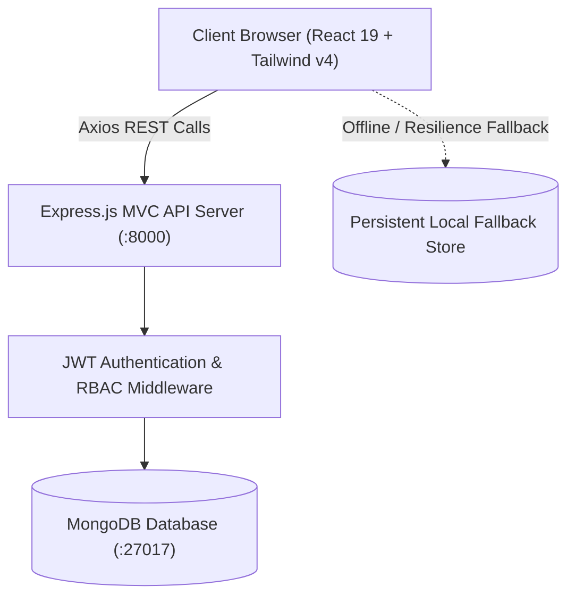

# HealthForecast AI

**Hospital Readmission Prediction & Patient Risk Intelligence System**

An AI-powered healthcare analytics platform that predicts hospital readmissions,
identifies high-risk patients, evaluates treatment effectiveness and supports
proactive patient care planning.

> **Interns start here: [INTERN_GUIDE.md](INTERN_GUIDE.md).**
> You work on your own branch. Nothing is merged into `main`.

---

## What it does

The platform helps hospitals reduce unnecessary readmissions, improve patient
outcomes and optimise healthcare resources through patient risk prediction,
readmission forecasting, treatment effectiveness analysis and hospital
performance reporting.

Intended users: hospitals, healthcare providers, clinics, insurance companies,
healthcare researchers and public health organisations.

## Modules

| # | Module | Capability |
|---|--------|-----------|
| 1 | User Management | Doctor and administrator accounts, authentication, role management |
| 2 | Patient Data Management | Patient records, medical history, treatment and admission tracking |
| 3 | Risk Prediction | Risk analysis, readmission probability, high-risk identification |
| 4 | Treatment Effectiveness | Outcome evaluation, recovery and medication effectiveness analysis |
| 5 | Clinical Decision Support | Care recommendations, follow-up planning, discharge support |
| 6 | Healthcare Analytics Dashboard | Readmission analytics, hospital performance, trend visualisation |
| 7 | AI Model Management | Model training, evaluation, prediction monitoring, optimisation |

## Roles

Four roles, each with a distinct view of the data. The full access matrix is in
[`docs/04-rbac/`](docs/04-rbac/) and is enforced in code by
[`backend/app/core/rbac.py`](backend/app/core/rbac.py).

| Role | Sees |
|------|------|
| **Doctor** | Assigned patients, their risk predictions and care recommendations |
| **Hospital Administrator** | Hospital-wide analytics and performance, read-only on records |
| **Healthcare Researcher** | Anonymised cohorts and aggregated statistics only |
| **System Administrator** | Everything, plus user and model management |

## Tech stack

| Layer | Technology |
|-------|-----------|
| Backend | Python 3.11, FastAPI, SQLAlchemy, Alembic, JWT |
| Frontend | Next.js 15, React 19, TypeScript, Tailwind CSS, Recharts |
| Databases | PostgreSQL 16, MongoDB 7 |
| ML | scikit-learn, XGBoost, Random Forest, TensorFlow, pandas, NumPy |
| DevOps | Docker, Docker Compose, GitHub Actions, AWS or Azure |

## Quick start

```bash
git clone https://github.com/GKSJ-AI-CliniScan/HealthForecastAI.git
cd HealthForecastAI
cp .env.example .env
docker compose up --build
```

| Service | URL |
|---------|-----|
| Frontend | <http://localhost:3000> |
| Backend | <http://localhost:8000> |
| API docs | <http://localhost:8000/docs> |

Running each service directly, without Docker, is covered in
[INTERN_GUIDE.md](INTERN_GUIDE.md#2-get-set-up).

## Repository layout

| Path | Contents |
|------|----------|
| [`backend/`](backend/) | FastAPI service - API, RBAC, ORM, migrations, tests |
| [`frontend/`](frontend/) | Next.js dashboards |
| [`ml/`](ml/) | Modelling pipeline - preprocessing, training, evaluation |
| [`database/`](database/) | PostgreSQL schema, MongoDB collection definitions |
| [`deployment/`](deployment/) | Docker, nginx, AWS and Azure notes |
| [`docs/`](docs/) | Architecture, database, API, RBAC, wireframes, milestones, testing, deployment |
| [`scripts/ci/`](scripts/ci/) | The check scripts CI runs |
| [`tests/`](tests/) | Integration and end-to-end tests |
| [`.github/workflows/`](.github/workflows/) | CI, branch guard, security, progress report, deploy |

## Milestones

| Milestone | Weeks | Theme | Status on `main` |
|-----------|-------|-------|------------------|
| 1 | 1-2 | Project initialization, design process and core setup | **Complete** |
| 2 | 3-4 | Risk prediction and readmission forecasting | **Complete** |
| 3 | 5-6 | Treatment effectiveness analysis and healthcare analytics | Treatment effectiveness **done** on `intern/13-rambilas-sah` - see [Milestone 3 report](MILESTONE_3_REPORT.md) |
| 4 | 7-8 | Testing, deployment and documentation | Not started |

Report templates and evaluation criteria: [`docs/06-milestones/`](docs/06-milestones/).

### What works today

`main` carries a working reference implementation of Milestones 1 and 2:

- JWT authentication with bcrypt hashing, audited logins, and immediate session
  revocation when an account is deactivated
- The full access matrix enforced in code and pinned by tests, with scoping
  applied inside the SQL query rather than after it
- Patient management with search, pagination and admission history
- Role-aware dashboards for all four roles, built from real aggregates
- The Diabetes 130-US Hospitals dataset loaded: 101,766 raw encounters cleaned
  to 69,990, an 8.98% 30-day readmission rate
- 30-day readmission risk scoring: a calibrated model serving real-time and
  batch predictions, risk banding, forecasting and global risk drivers.
  ROC-AUC 0.65; the high band runs **2.86x** the baseline readmission rate, and
  the forecast lands within **1.6%** of the observed count

Treatment effectiveness analysis is implemented on `intern/13-rambilas-sah`
(Milestone 3). `GET /api/v1/treatment/summary`, `/medications` and
`/recovery-trends` aggregate outcomes in SQL over `treatment_outcomes` joined to
its admission and patient - no reference baselines and no synthesised trend
series, so an empty table renders an empty state. Each figure is a documented
proxy: success means no 30-day readmission, a complication means the episode
ended somewhere other than home, and recovery is a composite index above a
stated target. Doctors hold `treatment_report:read_limited`, which returns the
same aggregation narrowed to their own caseload inside the `WHERE` clause.
Demo seed included; 119 backend tests pass. Analytics dashboards for the
hospital-admin and researcher screens remain outstanding.

Full write-ups: [milestone-1](docs/06-milestones/milestone-1.md) ·
[milestone-2](docs/06-milestones/milestone-2.md) ·
[milestone-3](MILESTONE_3_REPORT.md).

## Continuous integration

CI runs on **every branch**, and skips the jobs whose folders do not exist yet,
so an early branch is not failed for work that has not started.

| Workflow | Trigger | Purpose |
|----------|---------|---------|
| [CI](.github/workflows/ci.yml) | Every push and pull request | Repository checks, backend, frontend, ML, Docker |
| [Branch guard](.github/workflows/branch-guard.yml) | Pull requests | Blocks pull requests into `main` |
| [Security](.github/workflows/security.yml) | Every push, weekly | `pip-audit`, `npm audit`, CodeQL |
| [Cohort report](.github/workflows/cohort-report.yml) | Weekly, on demand | Every intern in the roster: branch, commits ahead, CI result, last push |
| [Deploy](.github/workflows/deploy.yml) | Manual only | Milestone 4: verify, build images, release to your environment |

The full list of checks and how to run them locally is in
[INTERN_GUIDE.md](INTERN_GUIDE.md#6-what-ci-checks).

## Contributing

This is an internship project repository.

- Work on `intern/<your-name>`.
- Do not push to `main`.
- Do not open pull requests into `main`.
- Never commit datasets, model artifacts, `.env` files, credentials, or any
  real patient data.

Read [INTERN_GUIDE.md](INTERN_GUIDE.md) before your first commit.

## Dataset

Diabetes 130-US Hospitals (1999-2008), 101,766 encounters.
Download instructions: [`ml/data/README.md`](ml/data/README.md).
**The dataset is never committed to this repository.**

## Licence

See [LICENSE](LICENSE).

# 🏥 HealthForecast AI — St. Jude Medical Center

> **Enterprise Hospital Readmission Prediction, Patient Risk Stratification & Clinical Intelligence Platform**

[](https://react.dev/)
[](https://tailwindcss.com/)
[](https://nodejs.org/)
[](https://expressjs.com/)
[](https://www.mongodb.com/)
[](https://vitejs.dev/)
[](https://jwt.io/)

---

## 📖 Overview

**HealthForecast AI** is a full-stack MERN clinical operations and risk intelligence system developed for **St. Jude Medical Center**. The platform empowers healthcare clinicians, administrators, researchers, and system controllers with real-time biometric telemetry, automated 30-day readmission forecasting, clinical progress note writing, medication prescription management, and hospital-wide operational benchmarks.

---

## 🌟 Key Capabilities by Role

```
                     ┌────────────────────────────────────────────────────────┐
                     │          St. Jude Medical Center Gateway               │
                     └──────────────────────────┬─────────────────────────────┘
                                                │
                 ┌───────────────┬──────────────┴──────────────┬───────────────┐
                 ▼               ▼                             ▼               ▼
          🩺 Doctor Portal  🏦 Admin Portal             🧪 Research Lab  💻 SysAdmin Console
          • Patient Registry • Hospital KPIs            • Demographics   • Staff Directory
          • Risk Analysis    • Department Performance   • Cohort Trends  • RBAC Roles
          • Clinical Notes   • Capacity Index           • Anonymized DB  • Model Registry
          • Prescriptions    • CSV Spreadsheet Export   • Data Catalog   • Audit Log Stream
```

### 🩺 1. Doctor & Clinician Workspace (`/doctor/*`)
- **Interactive Risk Distribution**: Real-time visualization of patient cohorts categorizing high, medium, and low-risk readmission probabilities.
- **Patient Management Registry**: Live search, multi-criteria filtering (by Risk, Diagnosis, Doctor), multi-column sorting, and **Patient Registration**.
- **Clinical Action Tools**:
  - 📝 **Write Clinical Notes**: Categorized progress notes, physician consultations, and triage notes.
  - 💊 **Prescribe Medications**: Add medications and therapy regimens.
  - 💓 **Update Recovery Vitals**: Track blood pressure readings, recovery progress scores (0–100%), and medication adherence.
  - 🚪 **Status & Discharge Management**: Transition patients between *Stable*, *Improving*, *Critical*, or *Discharged*.
- **Clinical Decision Support Hub**: Interactive checklist to validate AI-recommended care protocols and discharge criteria.
- **Treatment Effectiveness & Medication Outcome Analytics** (`/doctor/treatment-effectiveness`): protocol success-versus-complication matrix, Cardiac / Renal / Pulmonary recovery trajectories by day of stay, disease-group filtering and CSV report export — served by `/api/v1/treatment/*` and scoped to the signed-in doctor's own caseload.

### 🏦 2. Hospital Administrator Workspace (`/hospital-admin/*`)
- **Executive Dashboard**: Active inpatient count (1,420), bed occupancy management (81.3%), and readmission rate (14.2% vs 12.0% target).
- **Department Performance Benchmarks**: Recovery progress tracking across all 6 specialized hospital clinics.
- **Reporting & Export Engine**: Configurable query builder with automated **CSV spreadsheet export and browser download**.

### 🧪 3. Healthcare Researcher Workspace (`/researcher/*`)
- **HIPAA-Compliant Anonymization**: Automated PII sanitization across all research datasets.
- **Population Health Analytics**: Demographic age cluster distributions, stay duration analysis, and diagnosis correlations.
- **Longitudinal Trend Tracking**: Multi-month area charts tracking readmission benchmarks over time.
- **Research Datasets Repository**: Downloadable sanitized research cohorts with comprehensive data dictionaries.

### 💻 4. System Administrator Console (`/system-admin/*`)
- **Staff User Directory (CRUD)**: Create staff accounts, toggle active/inactive account status, reassign RBAC roles, and delete records.
- **Role Permission Matrix (RBAC)**: Fine-grained capabilities grid across all system roles.
- **AI Model Registry**: Machine learning telemetry, model weights, and simulated retraining triggers.
- **Live Security Audit Logs**: Searchable, timestamped audit trails capturing all logins and clinical write actions.
- **System Settings**: Configurable session timeouts, audit log retention rules, and complete system backup exports.

---

## 🎨 3D User Interface & Design Standards

- **Theme**: Crisp White (`#ffffff`, `bg-zinc-50`) with Crimson Red (`#dc2626`, `from-red-600 to-rose-700`) accents.
- **3D Components**:
  - **Mouse-Tracking 3D TiltCards**: React components that dynamically tilt on the X/Y axes in response to cursor position.
  - **3D Perspective Grid Floor**: Angled CSS 3D plane in the Hero section.
  - **Floating Stat Pills**: Continuous gentle float animations on key metrics.
  - **3D Rotating Logo Cube**: Perspective-transformed hospital crest.

---

## 🏗️ System Architecture



---

## 📁 Repository Structure

```
infosys/
├── backend/                        # Express.js MVC Backend
│   ├── config/                     # Database connection (db.js)
│   ├── controllers/                # Business logic (auth, patient, analytics, admin)
│   ├── middleware/                 # Auth, RBAC, error handling, audit logging
│   ├── models/                     # Mongoose schemas (User, Patient, Encounter, etc.)
│   ├── routes/                     # REST API route definitions
│   ├── utils/                      # Database seeder (seeder.js)
│   ├── .env.example                # Environment variables template
│   ├── package.json
│   └── server.js                   # Express server entry point
│
├── frontend/                       # React 19 + Vite + Tailwind CSS v4 Frontend
│   ├── public/                     # Static assets
│   ├── src/
│   │   ├── components/
│   │   │   ├── common/             # TiltCard, Modal, DashboardCard, Badges, etc.
│   │   │   └── layout/             # DashboardLayout (Sidebar, Navbar, Breadcrumbs)
│   │   ├── context/                # AuthContext (JWT session management)
│   │   ├── data/                   # Initial mock datasets
│   │   ├── pages/
│   │   │   ├── auth/               # LoginPage, ForgotPassword, NotFound, etc.
│   │   │   ├── doctor/             # DoctorDashboard, Patients, PatientDetails, etc.
│   │   │   ├── hospital-admin/     # AdminDashboard, OutcomeAnalytics, Reports, etc.
│   │   │   ├── researcher/         # ResearcherDashboard, PopulationHealth, etc.
│   │   │   ├── system-admin/       # SystemAdminDashboard, UserManagement, etc.
│   │   │   └── HomePage.jsx        # Public 3D Hospital Landing Page
│   │   ├── services/               # API service clients (auth, patient, analytics, admin)
│   │   ├── App.jsx                 # Route definitions & protected gateways
│   │   ├── index.css               # Tailwind v4 base styles & 3D keyframe animations
│   │   └── main.jsx                # React DOM entry point
│   ├── package.json
│   └── vite.config.js
│
├── .gitignore                      # Comprehensive Git exclusion rules
├── milestone.md                    # Detailed progress report & feature log
├── MILESTONE_1_REPORT.md           # Milestone submission report
└── README.md                       # Project documentation (this file)
```

---

## ⚙️ Installation & Quick Start

### 1. Prerequisites
- **Node.js** (v18.0.0 or higher)
- **MongoDB** (Local instance running at `mongodb://127.0.0.1:27017` or MongoDB Atlas URI)
- **npm** or **yarn**

---

### 2. Backend Setup

```bash
# Navigate to the backend directory
cd backend

# Install dependencies
npm install

# (Optional) Seed the database with initial users and patient records
npm run seed

# Start the backend server
npm run dev
```
> 🚀 Backend API will be running at: `http://localhost:8000`  
> 🔍 API Health check endpoint: `http://localhost:8000/api/v1/health`

---

### 3. Frontend Setup

```bash
# Navigate to the frontend directory
cd frontend

# Install dependencies
npm install

# Start the Vite development server
npm run dev
```
> 🌐 Frontend Application will be accessible at: `http://localhost:5173`

---

## 🔑 Default Test Credentials

The accounts the FastAPI service seeds, from `backend/app/db/init_db.py`:

| Role | Email | Password | Default Landing Page |
|---|---|---|---|
| 🩺 **Doctor / Clinician** | `dr.reddy@healthforecast.org` | `password123` | `/doctor/dashboard` |
| 🩺 **Doctor (2nd)** | `dr.mehta@healthforecast.org` | `password123` | `/doctor/dashboard` |
| 🏦 **Hospital Administrator** | `admin.ops@healthforecast.org` | `password123` | `/hospital-admin/dashboard` |
| 🧪 **Healthcare Researcher** | `researcher@healthforecast.org` | `password123` | `/researcher/dashboard` |
| 💻 **System Administrator** | `admin@healthforecast.org` | `password123` | `/system-admin/dashboard` |

`password123` is whatever you seed with — the login page prefills this value, so
run `SEED_PASSWORD='password123' python -m app.db.init_db` for the role buttons to
work click-through. Two doctors exist so caseload scoping is demonstrable.

---

## 📡 REST API Reference

| Method | Endpoint | Description | Auth Required |
|---|---|---|---|
| `POST` | `/api/v1/auth/login` | Authenticate user & issue JWT token | No |
| `GET` | `/api/v1/auth/me` | Fetch currently authenticated user session | Yes |
| `GET` | `/api/v1/patients` | Retrieve patient list with search & filters | Yes (Doctor, Admin, SysAdmin) |
| `POST` | `/api/v1/patients` | Register new clinical patient record | Yes (Doctor, Admin, SysAdmin) |
| `GET` | `/api/v1/patients/:id` | Fetch complete patient clinical worksheet | Yes |
| `PUT` | `/api/v1/patients/:id` | Update patient record and vitals | Yes (Doctor, Admin, SysAdmin) |
| `POST` | `/api/v1/patients/:id/notes` | Add clinical progress note to patient | Yes (Doctor, Admin) |
| `POST` | `/api/v1/patients/:id/treatments` | Add medication / treatment to patient | Yes (Doctor) |
| `GET` | `/api/v1/treatment` | Flat per-regimen outcome rollup | Yes |
| `GET` | `/api/v1/treatment/summary` | Headline success / recovery / complication rates, protocol matrix and recovery trend in one call | Yes (Doctor: own caseload; Admin: hospital-wide) |
| `GET` | `/api/v1/treatment/medications` | Protocol efficacy vs complication rate | Yes (as above) |
| `GET` | `/api/v1/treatment/recovery-trends` | Mean recovery index per day of stay, split by specialty cohort | Yes (as above) |
| `GET` | `/api/v1/analytics/hospital-dashboard` | Aggregate hospital KPIs & departmental metrics | Yes (Hospital Admin) |
| `GET` | `/api/v1/analytics/research-data` | Retrieve de-identified research cohorts | Yes (Researcher) |
| `GET` | `/api/v1/admin/dashboard` | Retrieve system telemetry and audit logs | Yes (System Admin) |
| `GET` | `/api/v1/admin/users` | List staff directory user accounts | Yes (System Admin) |
| `POST` | `/api/v1/admin/users` | Create new staff user account | Yes (System Admin) |
| `PUT` | `/api/v1/admin/users/:id/role` | Update user RBAC permissions | Yes (System Admin) |
| `PUT` | `/api/v1/admin/users/:id/toggle-status` | Toggle user active/inactive status | Yes (System Admin) |

---

## 📄 License & Attribution

Developed for **St. Jude Medical Center — HealthForecast AI**.  
Built with the MERN stack (MongoDB, Express.js, React 19, Node.js) and Tailwind CSS v4.

made for the internship project
